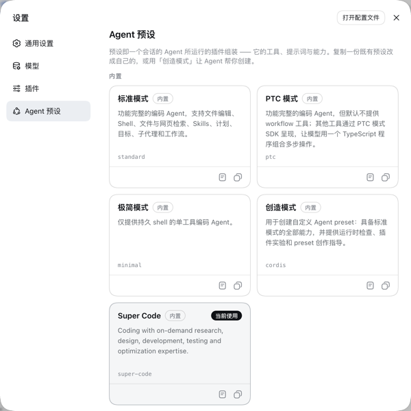
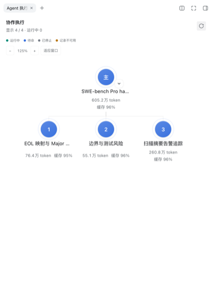

# dsh-super-code

一个更快、更节省、更准确的 DeepSeek Harness 编码插件。

在选定的 SWE-bench Pro hard-100 评测中，平均耗时减少约 36%，每题输入 token 减少约 17%，正确率提高 5 个百分点。

A faster, more accurate, and more cost-effective DeepSeek Harness plug-in component.

On the selected SWE-bench Pro hard-100 evaluation, average elapsed time decreased by about 36%, input tokens per task by about 17%, and accuracy increased by 5 percentage points.

## 介绍 · Introduction

`dsh-super-code` 是 DeepSeek Harness 的编码插件，提供一个可直接使用的 `super-code` Agent 预设。

`dsh-super-code` is a coding plugin for DeepSeek Harness with one ready-to-use `super-code` Agent preset.

它会根据任务选择调研、设计、开发、验证和优化方法，简单任务直接完成，复杂任务按需组织工作。

It selects research, design, development, verification, and optimization methods as needed for each task.

## 在 DeepSeek Harness 中安装 · Installation

要求 DeepSeek Harness 0.1.5-rc.1 或更高版本。

Requires DeepSeek Harness 0.1.5-rc.1 or later.

```bash
dsh plugin --profile web add dsh-super-code
```

安装后在 Harness 的 “设置”-“Agent 预设” 中选择 `super-code`，模型、权限和工具继续使用 Harness 的配置。

After installation, select `super-code` in "Settings" - "Agent Presets" in Harness; models, permissions, and tools use the Harness configuration.

若安装后找不到预设，插件会在首次加载时尝试安装一份用户预设。也可打开“设置”→“插件”→“插件配置”中的 **Super Code** 查看状态并手动安装；名称冲突时换个名称即可，已有预设不会被覆盖。用户副本不会自动更新，删除后也不会在重启时自动重装。

If the preset is missing, the plugin attempts a one-time user-preset installation on first load. Open **Super Code** under “Settings” → “Plugins” → “Plugin configuration” to check its status or install manually. Choose another name if it is taken. Existing presets are preserved; user copies are not automatically updated or reinstalled after deletion.

[版本记录 · Changelog](docs/CHANGELOG.md)

[](docs/images/preset-settings.png)

当前版本不使用三模型池，也不需要单独配置插件模型。在 Harness“设置”→“模型”中配置提供方，再从对话输入框下方选择模型和推理等级；已有可用配置时直接沿用。插件跟随当前会话的模型，子 Agent 在未单独覆盖时继承父 Agent 的选择。

The current version has no three-pool model configuration. Configure a provider under Harness “Settings” → “Models”, then select the model and reasoning effort below the message input. Existing working settings can be reused. The plugin follows the current session model, and child Agents inherit their parent's selection unless explicitly overridden.

## 效果 · Results

SWE-bench Pro hard-100，使用 `deepseek-v4.1-flash`、reasoning `high`、原生 DSH Web RPC 和官方评分器。

SWE-bench Pro hard-100 with `deepseek-v4.1-flash`, reasoning `high`, native DSH Web RPC, and the official grader.

> 提示：
> SWE-bench Pro 是面向真实软件工程任务的高难度评测集。每道题都来自真实开源仓库，通常需要理解现有代码、修改多个文件、运行测试并根据失败结果继续修复，评测结果以官方测试是否通过为准。这里选取其中难度最高的 100 道题，重点观察长任务中的正确率、调用次数、token 和耗时。
>
> SWE-bench Pro is a challenging benchmark for real-world software engineering tasks. Each task comes from a real open-source repository and typically requires understanding existing code, editing multiple files, running tests, and iterating on failures. The official test result is the pass criterion. This evaluation uses the 100 hardest selected tasks to measure accuracy, model calls, token usage, and elapsed time on long-running tasks.
>
> 经过预评测，`DSH minimal` 预设和 `deepseek-v4.1-flash` 的 `high` 思考强度取得了最高正确率，因此将它们作为统一比较基准。
>
> In preliminary runs, the `DSH minimal` preset with `deepseek-v4.1-flash` at `high` reasoning achieved the highest accuracy, so it is used as the common baseline.

这批结果来自 `0.0.9` 候选；`0.1.0` 沿用该历史基准，未重新执行完整 100 题评测。

These results are from the `0.0.9` candidate. Version `0.1.0` retains this historical benchmark; the full 100-task evaluation has not been rerun for this release.

| 指标 / Metric | DSH minimal | super-code 0.0.9 | 优化幅度 / Change |
|---|---:|---:|---:|
| 有效评分 / Valid scores | 100/100 | 100/100 | **持平 / 0%** |
| 通过题数 / Passed | 41 | 46 | **+12.2%** |
| 正确率 / Accuracy | 41% | 46% | **+5 个百分点 / +5 pp** |
| 平均模型调用/题 / Model calls per task | 124.85 | 92.78 | **-25.7%** |
| 平均工具调用/题 / Tool calls per task | 126.54 | 115.41 | **-8.9%** |
| 每题平均总输入 token / Average total input tokens per task | 11,477,170 | 9,525,316 | **-17.0%** |
| 每题平均总输出 token / Average total output tokens per task | 100,877 | 97,901 | **-3.0%** |
| 缓存命中率 / Cache hit rate | 99.360% | 99.329% | **-0.031%** |
| 平均测试时长 / Average test time | 25.49 分钟 / min | 16.27 分钟 / min | **-36.2%** |

> 因为输入和输出 token 均有减少，因此缓存命中率略微下降是可以接受的，属于正常波动范围。
>
> Since both input and output token usage decrease, the slight drop in cache hit rate is acceptable and within normal variation.

> Token 指标按每道题的历史明细计算：先分别合计该题已记录模型调用的输入（含缓存）和输出 token，再对 100 道题取平均，包含多轮调用和上下文增长；未返回用量的请求不作估算，不代表完整账单费用。
>
> Token metrics are calculated from task histories: input (including cached tokens) and output tokens are summed separately across recorded model calls for each task, then averaged over 100 tasks. This includes multi-turn calls and context growth. Requests without reported usage are not estimated; these figures do not represent complete billing costs.

测试题号和每题明细见 [`eval/results/swebench-pro-final-100/`](eval/results/swebench-pro-final-100/)，详细文档见 [`docs/`](docs/)。

Task IDs and per-task details are available in [`eval/results/swebench-pro-final-100/`](eval/results/swebench-pro-final-100); detailed documentation is in [`docs/`](docs/).

## 使用 · Usage

安装后，在 DeepSeek Harness 的“设置”→“Agent 预设”中选择 `super-code`。创建任务后，插件会按任务复杂度组织调研、实现和验证；复杂任务可在右侧 Agent 执行树中查看进度，点击节点查看对应的执行内容和用量。

After installation, select `super-code` under “Settings” → “Agent Presets” in DeepSeek Harness. The plugin organizes research, implementation, and verification according to task complexity; for complex tasks, use the Agent execution tree on the right to inspect progress, execution details, and usage.

[](docs/images/agent-tree.png)

截图来自全新隔离会话中的 DSH 网页版，展示 hard-100 难度排名第一题 `task-099`（`future-architect/vuls` 的 OS 生命周期预警）的初步调研：一个主 Agent 与三个子 Agent 分别核查 EOL/版本解析、告警链路和测试边界。图中保留了整个右侧栏，包括状态、用量、缓存率和缩放操作；这是协作展示，不代表该题已修复或通过评分。

Captured from a fresh, isolated DSH web session, the full sidebar shows initial investigation of the highest-ranked hard-100 task, `task-099` (`future-architect/vuls`, OS lifecycle warnings). A lead Agent and three child Agents investigate EOL/version parsing, the warning pipeline, and test boundaries. Status, usage, cache hit rate, and zoom controls are all visible. This is a collaboration example, not a claim that the task was fixed or passed grading.

拖动空白处平移，滚轮或按钮缩放，点击节点在侧边栏新标签中查看详情。插件界面跟随 Harness 的中英文语言设置。

Drag empty space to pan, use the wheel or buttons to zoom, and click a node to open its details in a sidebar tab. The plugin follows the Harness Chinese/English language setting.

## 感谢 · Thanks

感谢 DeepSeek Harness、SWE-bench Pro 及所有开源项目维护者。

Thanks to the DeepSeek Harness team, SWE-bench Pro contributors, and all open-source maintainers.
