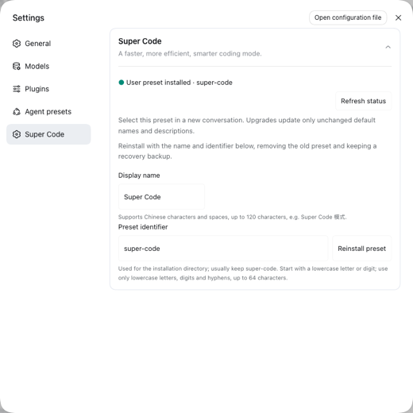
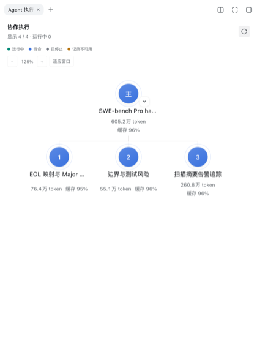

# dsh-super-code

一个更快、更节省、更聪明的 DeepSeek Harness 编码插件。简单任务直接做，复杂任务按需组织专业 Agent；任务状态和有来源的经验可以留到后续对话，不必反复交代。

A faster, more efficient coding plugin for DeepSeek Harness. It handles straightforward tasks directly, brings in specialist Agents when useful, and keeps sourced knowledge available for later conversations.

在同一组 SWE-bench Pro hard-100 的校正结果中，0.2.0 分层记忆候选相比官方 minimal，平均回答耗时减少 **41%**、每题总 token 减少 **20%**，通过率从 **44% 提高到 52%**。[完整结果与限制](docs/EvaluationResults.md)

On the same SWE-bench Pro hard-100 set, the corrected results for the 0.2.0 memory-hierarchy candidate show **41% less response time**, **20% fewer total tokens**, and a pass rate of **52% versus 44%** for official minimal. [Full results and limitations](docs/EvaluationResults.md)

## 0.2.0 候选 · What's New

- **分层记忆：** 区分本次任务、当前项目和全局偏好；只自动带入少量相关摘要，需要时再读详情。
  **Layered memory:** Separates task state, project knowledge, and global preferences. Only a few relevant summaries enter context; details are read when needed.
- **记忆库：** 在右侧新标签查看和搜索记忆；Agent 详情中能看到带入上下文、读取、保存和删除记录。
  **Memory library:** Browse and search memories in a sidebar tab, and see each Agent's recorded context, reads, saves, and removals in its details.
- **宿主兼容：** 保留旧版目录预设，并适配新版声明式预设及消息格式。具体版本和验收范围见[兼容矩阵](docs/Compatibility.md)。
  **Host compatibility:** Keeps directory presets on older hosts and supports newer declarative presets and message formats. See the [verified versions and scope](docs/Compatibility.md).

0.2.0 当前为候选，尚未发布到 npm；发布前请使用候选安装包。效果数据来自已冻结的分层记忆实验，不是新增 UI 和兼容改动后的又一轮 100 题评测。

Version 0.2.0 is a candidate, not yet published to npm; use the candidate package before release. Its quality results belong to the frozen memory-hierarchy experiment, not a new 100-task run of the integrated UI and compatibility changes.

## 开始使用 · Get Started

需要 Node.js 22 或更高版本，以及[已验证的 Harness 版本](docs/Compatibility.md)。

Use Node.js 22 or later and a [verified Harness version](docs/Compatibility.md).

1. **安装：** 在插件市场搜索 `dsh-super-code`，或运行以下命令安装 npm 已发布版。

   **Install:** Search for `dsh-super-code` in the plugin marketplace, or install the published npm version:

   ```bash
   dsh plugin --profile web add dsh-super-code
   ```

   候选包可用 `dsh plugin --profile web add ./dsh-super-code-0.2.0.tgz` 安装。
   For the candidate, use `dsh plugin --profile web add ./dsh-super-code-0.2.0.tgz`.

2. **选中预设：** 打开“设置”→“Agent 预设”，选择 `super-code`。

   **Select the preset:** Open “Settings” → “Agent Presets” and choose `super-code`.

3. **开始对话：** 新建会话，描述你要完成的编码任务。模型、推理等级、权限和工具沿用 Harness 的设置；子 Agent 默认继承父 Agent 的模型，不用另配模型池。

   **Start a conversation:** Open a new session and describe the task. Models, reasoning effort, permissions, and tools come from Harness; child Agents inherit the parent's model by default.

没看到预设？在“设置”→ **Super Code** 查看状态；旧插件版本的入口在“插件配置”中。[安装与排查](docs/UsageGuide.md)

Can't find the preset? Open “Settings” → **Super Code**. Older plugin versions place this under “Plugin configuration”. [Setup and troubleshooting](docs/UsageGuide.md)

[](docs/images/preset-settings.png)

右侧执行树显示各 Agent 的状态、用量和缓存率。拖动平移、滚轮缩放；点节点查看详情，不切换主对话。右侧新标签页中的“记忆库”可以查看当前项目和全局偏好。[界面与记忆说明](docs/UsageGuide.md)

The Agent tree shows status, usage, and cache hit rate. Drag to pan, scroll to zoom, and click a node for details without leaving the main conversation. Open “Memory library” from the sidebar's new-tab page to view project knowledge and global preferences. [Interface and memory guide](docs/UsageGuide.md)

[](docs/images/agent-tree.png)

## 效果 · Results

同一组 100 题，均完成官方评分；评分环境异常已使用原补丁复核。时间不含官方评分，token 包含缓存输入，并不等于费用。

All four versions received official scores for the same 100 tasks. Grading anomalies were rechecked with the original patches. Time excludes grading; tokens include cache reads and are not a monetary cost estimate.

| 指标 / Metric | 官方 minimal | 0.0.9 | 0.1.2 | 0.2.0 分层记忆 |
|---|---:|---:|---:|---:|
| 通过 / Passed | 44/100 | 48/100 | 52/100 | **52/100** |
| 平均耗时 / Minutes per task | 25.69 | 16.46 | 16.01 | **15.15** |
| 平均总 token / Tokens per task | 11,578,047 | 9,623,217 | 9,938,176 | **9,299,094** |
| 模型调用/题 / Model calls | 124.85 | 92.78 | 99.78 | 93.83 |

0.2.0 与 0.1.2 通过数相同，但有 6 题改善、6 题回退，不代表每道题都更好。这是已用于诊断的历史题集，各轮宿主版本也不同，不能把全部差异归因于插件或记忆功能。[多维指标、逐题证据与统计口径](docs/EvaluationResults.md)

Version 0.2.0 ties 0.1.2 overall, with six gains and six regressions—not an improvement on every task. This is a historically exposed diagnostic set, and host revisions differ between runs; the results do not isolate the effect of the plugin or memory alone. [Detailed metrics, per-task evidence, and methodology](docs/EvaluationResults.md)

[使用说明 · Usage](docs/UsageGuide.md) · [兼容性 · Compatibility](docs/Compatibility.md) · [版本记录 · Changelog](docs/Changelog.md)
