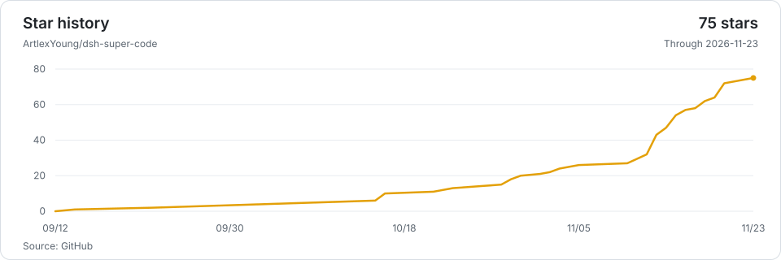
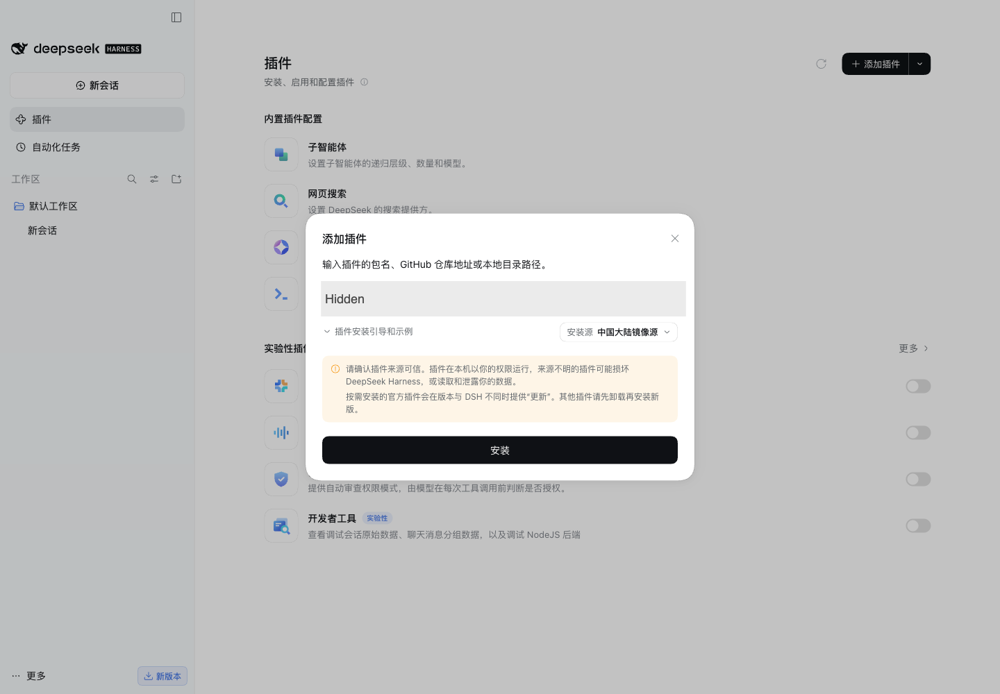
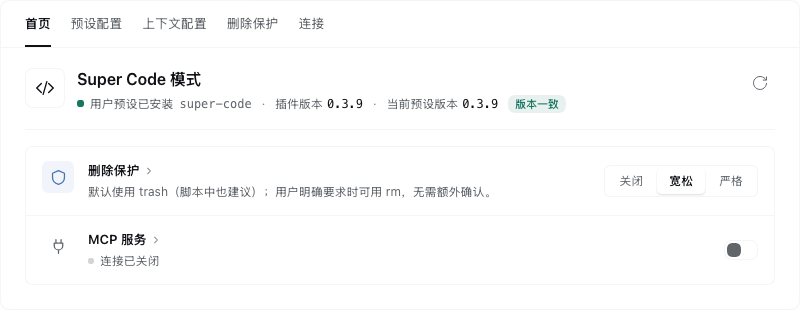
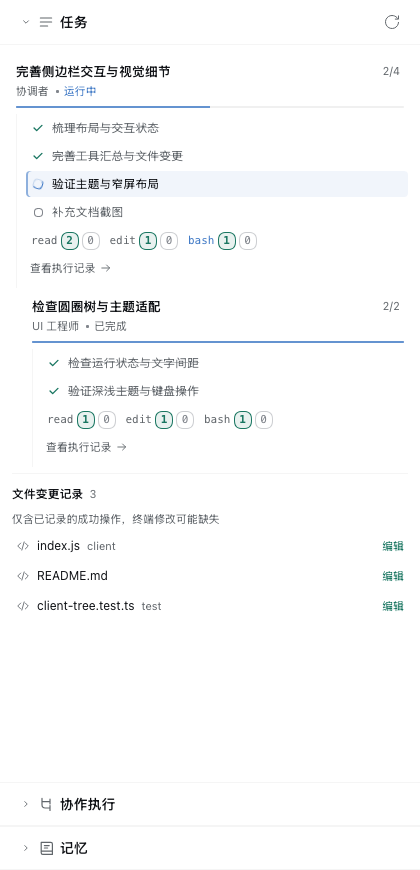
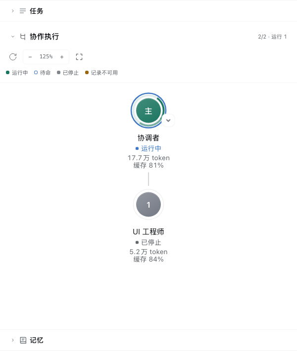

# dsh-super-code

中文 · [English](README.en.md)

[](https://npmtrends.com/dsh-super-code) [](https://www.npmjs.com/package/dsh-super-code) [](docs/Compatibility.md) [](LICENSE)

值得一试的 DeepSeek Harness 编程工具，更聪明、更节省、更好用。

# 1 特性

## 1.1 更聪明的预设

**Super Code 预设**围绕编程任务调优提示词与工作流，将任务规划、工具协作和项目记忆整合到一个预设里，选中即可开始。

- **批量工具调用**：一次模型调用并行读取多个文件，减少理解代码时的往返与等待。
- **分层记忆**：分别保存当前任务、项目经验和全局偏好，让经验跨任务复用，每条记录都有来源可查。
- **运行预算**：默认采用历史评测中表现较好的压缩预算，保留更多上下文，也可按需调整。
- **删除保护**：默认引导 Agent 使用可恢复的 `trash`，降低误删风险；需要时可切换为严格确认。
- **Windows 命令环境兼容**：自带 Bash 与常用命令，无需为运行 Bash 额外安装 Git，也可应用到官方预设。

**大模型输出存在波动，不同轮次的评测结果可能不同，请结合测试配置与统计口径阅读结果。**

在 SWE-bench Pro hard-100 上，与官方标准预设对比（同一 DSH 版本 `0.2.1-rc.2`、同一模型、均为 high 思考等级）：

| | 官方标准 + high | Super Code 0.3.11 | Super Code 0.4.0 |
|---|---:|---:|---:|
| 通过 | 47/100 | 50/100（+3题） | **52/100（+5题）** |
| 每题耗时 | 16.26 分钟 | 16.69 分钟（+2.7%） | 17.66 分钟（+8.6%） |
| 每题 Token | 771.8 万 | 667.3 万（-13.5%） | 689.5 万（-10.7%） |
| 每题模型调用 | 89.54 次 | 76.44 次（-14.6%） | 79.42 次（-11.3%） |

2026-11-11 测试：[历史评测结果与口径](docs/EvaluationResults.md)

## 1.2 更便捷的开发体验

**代码工作台**将您的工作从 IDE 迁移至 DSH ，一站式代码开发流程，深度融合大模型能力，即开即用。

- **轻量编辑器（开发中）**：熟悉的idea/vscode体验，在 Harness 中直接阅读和编辑项目文件，减少窗口切换。
- **Git（开发中）**：集中查看仓库状态与代码改动，处理常用版本管理操作，包括但不限于函数变更历史（✨）、文件对比、分支管理、远程推送。
- **预设 Skill（需手动开启）**：内置 grill-me、OpenSpec、oil-ui、Matt Pocock Skills 和 PStack，覆盖需求梳理、规范、界面与工程开发。默认全部关闭，启用后在已有对话中实时生效。
- **学习模式（开发中）**：结合当前项目讲解代码与实现思路，边开发边学习。

## 1.3 远程支持

- **远程项目支持（待发布）**：配合 `dsh-ssh-workspaces`，在轻量远程会话中执行服务器命令，继续使用任务与记忆工具，沿用原有审批、取消和断连保护。[使用说明](docs/UsageGuide.md#远程项目)。
- **dsh-Go / NEXT 远程控制（待发布）**：在运行 DSH 的机器上启用 Super Code，通过 dsh-Go / NEXT 的远程会话调用工具、管理任务和记忆；手机原生与网页界面的支持范围见[使用说明](docs/UsageGuide.md#dsh-go--dsh-next-远程控制)。
- **MCP 连接**：让支持 MCP 的 AI 编码工具将任务交给 DSH 执行，接入现有开发流程，默认关闭。

## 1.4 还有更多

- **模块隔离器（开发中）**：模块化各项功能，实现异常间的隔离，争取最大可用性。
- **轻量包体**：复用 Harness 的运行环境、模型与会话能力，以插件形式集成到现有开发环境。

> 内置及适配后的 Skill 源码统一公开在 [builtin/skills](builtin/skills)，保留各自的来源、许可证和配套资源；[目录与维护说明](builtin/README.md)。

# 2 最近更新

- **待发布**：完善远程项目与 dsh-Go / NEXT 远程控制，修复任务冷恢复、部分安装器的离线依赖解析及 Windows BusyBox 文件长路径问题；实测范围与限制见[兼容性记录](docs/Compatibility.md)。
- **0.4.1**：修复 Windows 在 Harness `0.2.2-rc.2` 中无法加载会话的问题（[#2](https://github.com/ArtlexYoung/dsh-super-code/issues/2)），随包携带运行依赖以支持本地离线安装，最低支持版本仍为 Harness `0.1.5-alpha.1`。
- **0.4.0**：简化任务与记忆工具，新增五组可选 Skill 与工作流，优化设置、任务侧栏和 Harness 兼容性。
- **0.3.11**：修复了大量 bug。

[完整版本记录](docs/Changelog.md)

版本号格式为「主版本.效果版本.维护版本」：第二位变化表示编码效果或效率有提升，第三位表示修复、界面和兼容性更新。每次发布前均需完成大量回归测试，因此更新周期可能较长。

# 3 趋势

**npm 下载趋势**

<a href="https://npmtrends.com/dsh-super-code">
  <picture>
    <source media="(prefers-color-scheme: dark)" srcset="docs/images/npm-downloads-dark.svg">
    
  </picture>
</a>

**Star**

<a href="https://star-history.com/#ArtlexYoung/dsh-super-code&amp;Date">
  <picture>
    <source media="(prefers-color-scheme: dark)" srcset="docs/images/star-history-dark.svg">
    
  </picture>
</a>

# 4 安装

支持 Harness `0.1.5-alpha.1` ～ `0.2.2-rc.2`，包括 `0.2.2-alpha.3`。0.4.0 已逐版验证 27 个 Web 版本，并验证官方 macOS 桌面版 `0.2.2-rc.2`、NEXT `2.0.22-next`（内置 Harness `0.2.2-rc.1`）；各版本与平台的实测范围见[兼容性记录](docs/Compatibility.md)。

**桌面版**：在左侧打开「插件 → 添加插件」，输入 `dsh-super-code`，依次点击「安装」和「立即启用」（旧版本请按提示重载或重启）。桌面版内置运行环境，无需安装 Node.js。

**Web / 命令行版**：插件要求 Node.js 22 及以上；Harness `0.2.2-rc.2` 要求 Node.js 24.9 及以上。

```bash
npm install -g @deepseek-ai/dsh            # 已安装 dsh 命令可跳过
dsh plugin --profile web add dsh-super-code
```

<details>
<summary>使用 Release 安装包（含离线安装）</summary>

从 [GitHub Releases](https://github.com/ArtlexYoung/dsh-super-code/releases) 下载 `.tgz` 文件。

桌面版：在「包名或地址」中填写安装包的完整路径，然后点击「安装」。

<a href="docs/images/install-tgz.png"></a>

Web 版：运行以下命令（文件名以实际下载的为准）：

```bash
dsh plugin --profile web add ./dsh-super-code-0.4.1.tgz
```

从 0.4.1 起，安装包自带插件所需的运行依赖。离线安装须提前下载 `.tgz` 并安装好 Harness；Web 版请显式加 `--offline`，避免安装器尝试联网：

```bash
dsh plugin --profile web add ./dsh-super-code-0.4.1.tgz --offline
```

部分安装器（已复现于 `pnpm 11.28.5`）会尝试补装 Harness 提供的依赖，导致正式版 `0.4.1` 在空缓存离线安装时失败；相关修复已在 main 完成，尚未发布，见[兼容性记录](docs/Compatibility.md)。

断网时调用云端模型仍需恢复网络；使用本机或局域网模型时，模型服务必须可达。

</details>

# 5 使用

> 详细内容见[使用说明](docs/UsageGuide.md)。

1. 打开「设置 → Agent 预设」，选择 **Super Code 模式**（标识符 `super-code`）。
2. 新建会话，描述任务即可。

模型、推理等级、权限和工具均沿用 Harness 的设置，无需单独配置；子 Agent 默认使用父 Agent 的模型。

若未找到预设，可在「设置 → Super Code 模式」中查看状态，或参阅[排查方法](docs/UsageGuide.md#找不到预设)。

<a href="docs/images/preset-settings.png"></a>

在右侧边栏选择「Super Code」，包含三个部分：

- **任务**：目标、步骤进度、工具调用汇总和已修改的文件，只读。
- **协作执行**：Agent 执行树，点击节点可查看详情。
- **记忆**：查看、新增、编辑和删除项目记忆与全局偏好。

三个部分始终只展开一项，默认显示任务；再次点击当前标题会保持展开。

<a href="docs/images/task-status.png"></a> <a href="docs/images/agent-tree.png"></a>

截图使用当前界面与演示数据，仅展示插件外观。

# 6 评测

## 6.1 插件方案对比

SWE-bench Pro hard-100 完整成绩，按通过数量降序排列。统一使用 Harness `0.2.1-rc.2`、`评测模型 B`、high、旧预算，各组内部连续复用环境。

| 方案 | 通过/有效 | 平均总 Token（M） | 平均耗时（分钟） | 平均模型调用 | 平均工具调用 | 缓存率 |
|---|---:|---:|---:|---:|---:|---:|
| Super Code 0.3.5 | **51/100** | 6.435 | 24.751 | 76.660 | 75.840 | 98.927% |
| 官方标准 | 50/100 | 8.030 | 17.198 | 91.990 | 113.880 | 99.167% |
| 原版 dsh-ops 0.4.4 · 标准 | 49/100 | 7.099 | 23.132 | 82.500 | 102.360 | 99.062% |
| 官方标准＋billion-context 0.1.209 | 45/100 | 6.359 | 18.471 | 108.950 | 131.140 | 97.654% |
| 原版 dsh-ops 0.4.4 · PTC | 44/100 | 7.322 | 23.695 | 81.490 | 80.960 | 99.056% |

M 为百万 Token，包含思考 Token；耗时包含部分运行内服务等待。这批追加成绩与开头及下方历史预算实验分开记录。[完整结果与口径](docs/EvaluationResults.md)

## 6.2 评测方法

- **题集**：SWE-bench Pro hard-100，使用官方评分器。调优仅使用 SWE-bench dev 中筛选的 33 道困难题；hard-100 只用于评测冻结后的候选版本和排查问题，不参与调优，以避免对评测题过拟合。
- **对照**：官方标准预设及第三方插件方案。历史官方预设对比中，DSH `0.1.5-rc.2` 下的标准 + high 通过 51 题，minimal + high 通过 46 题，且标准每题 token 少 23.5%，因此选用标准预设作为基线。
- **控制变量**：同一 DSH 版本对比保持模型、思考等级和预算一致，对比不同预设及插件组合；跨 DSH 版本、跨模型的实验单独说明。
- **指标**：通过数、平均总 Token、耗时、模型与工具调用次数、缓存率。上述插件方案对比表的耗时包含部分运行内服务等待；下方历史预算实验使用净耗时，扣除失败请求和重试等待。

## 6.3 历史评测过程

1. **DSH `0.1.5-rc.2` 基线**（`评测模型 B`，high）：Super Code `0.3.0` 候选通过 56 题，官方标准预设 51 题，minimal 46 题。相对 minimal，耗时减少 47.6%，token 减少 44.9%。
2. **升级到 DSH `0.2.1-rc.2` 后效果下降**：升级到 DSH `0.2.1-rc.2` 和 `评测模型 B` 后，在默认预算下标准降至 46 题，Super Code `0.3.4` 降至 41 题，低于标准。排查发现 DSH `0.2.1-rc.2` 收紧了上下文预算：压缩阈值由 800,000 降至 550,464 token，保留原文由 160,000 降至 98,560 token。
3. **恢复旧预算后复测**：双方均使用旧预算。标准仍为 46 题，token 增加 14.2%；Super Code `0.3.5` 提升至 49 题，token 仅增加 0.4%，净耗时减少 19.4%。据此，`0.3.6` 起插件默认使用旧预算。
4. **跨模型验证**（`glm-5.3-flash`，max）：Super Code `0.3.4` 通过 45 题，原生 ZCode 通过 29 题；Super Code 每题净耗时更少（32.9 vs 52.3 分钟），token 更多（550 万 vs 361 万）。

## 6.4 历史结果汇总

以下为较早的评测批次，不与上述插件方案对比的成绩合并计算。

| 对比 | 通过 | 效率 |
|---|---|---|
| DSH `0.2.1-rc.2`、旧预算：Super Code `0.3.5` vs 标准 + high | 49 vs 46 | 净耗时 -21.3%，token -34.6%，模型调用 -25.5% |
| DSH `0.2.1-rc.2`、默认预算：Super Code `0.3.4` vs 标准 + high | 41 vs 46 | token -25.5%，净耗时 +13.9% |
| DSH `0.1.5-rc.2`：Super Code `0.3.0` 候选 vs 标准 + high | 56 vs 51 | 原始耗时 -34.9%，token -27.9% |
| DSH `0.1.5-rc.2`：Super Code `0.3.0` 候选 vs minimal + high | 56 vs 46 | 耗时 -47.6%，token -44.9% |
| GLM-5.3-flash：Super Code `0.3.4` vs 原生 ZCode | 45 vs 29 | 耗时 -37.1%，token +52.4% |

## 6.5 限制

- 每组配置只运行一轮。同一道题在不同轮次中结果可能不同，目前尚未估计固定配置下的随机波动。
- 默认预算与旧预算两组的插件版本不同（`0.3.4` → `0.3.5`），收益不能全部归因于预算。
- `0.3.6` ~ `0.3.10` 未重新运行 100 题评测。
- 跨模型对比是两套完整系统之间的比较，无法单独分离插件的贡献。

[评测结果与口径](docs/EvaluationResults.md) · [完整成绩表](eval/results/swebench-pro-final-100/ResultsTables.md)

# 7 致谢

本项目认可 [LINUX DO](https://linux.do) 社区。

| 项目 | 参考内容 |
|---|---|
| [DeepSeek Harness](https://github.com/deepseek-ai/deepseek-harness)（MIT） | 提供 Agent、会话、工具、PTC、Skill、界面扩展 |
| [ZCode](https://github.com/zai-org/ZCode)（Apache-2.0） | 界面设计 |
| [Agent Skills](https://agentskills.io/specification) | 前端 Skill 的文件格式 |
| [oil-ui](https://github.com/oil-oil/oil-ui)（MIT） | 内置前端设计 Skill，提供设计流程、风格对比与画面评审 |
| [OpenSpec](https://github.com/Fission-AI/OpenSpec)（MIT） | 完整的规范驱动工作流 Skill 包 |
| [Matt Pocock Skills](https://github.com/mattpocock/skills)（MIT） | 完整的工程工作流 Skill 包 |
| [PStack](https://github.com/cursor/plugins/tree/main/pstack)（MIT） | 架构、开发、验证与评审的协作 Skill 包 |
| [SWE-bench](https://github.com/SWE-bench/SWE-bench)、[SWE-bench Pro](https://github.com/scaleapi/SWE-bench_Pro-os)（代码 MIT） | 调优题与评测题 |
| [js-yaml](https://github.com/nodeca/js-yaml)、[Zod](https://github.com/colinhacks/zod)（MIT） | YAML 解析、数据校验 |

[详细致谢与许可证](docs/Acknowledgements.md) · 本项目采用 [Apache-2.0](LICENSE) 许可证。
